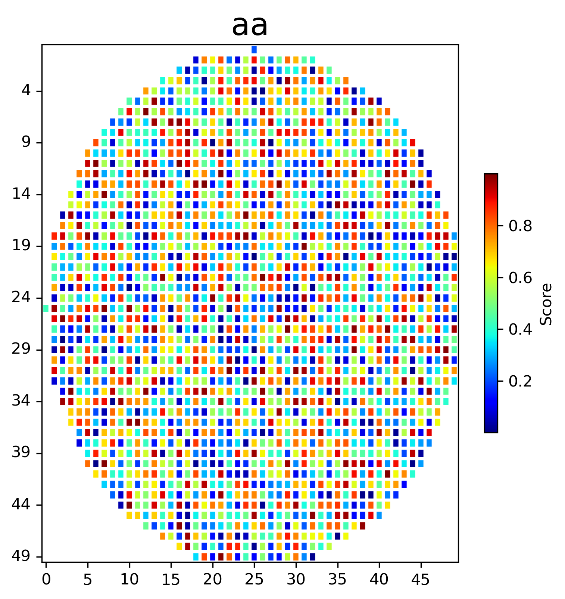
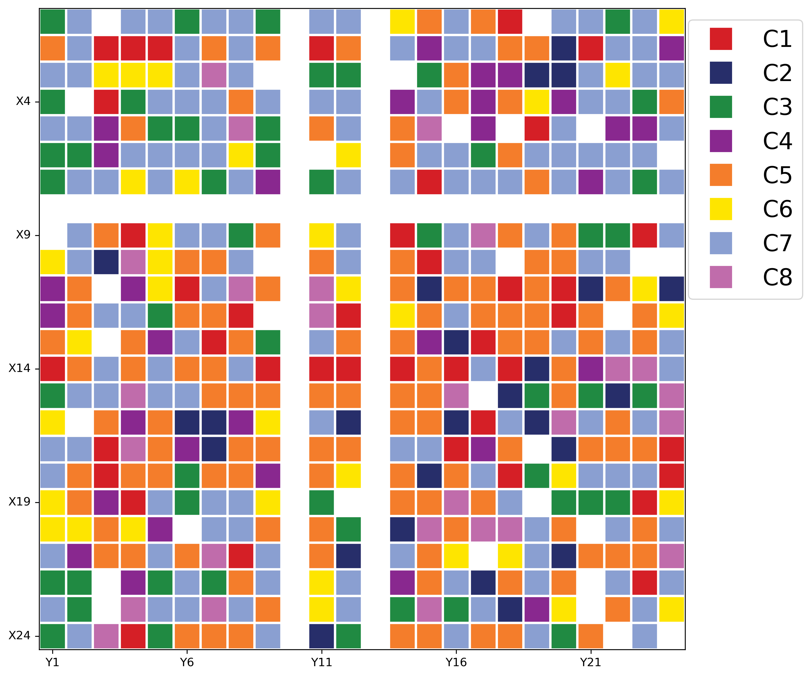

# Python-Course-project

## Project

I am working on 2-D cell image visulization. For a given animal tissue, we could detect the target gene signal for each cell. After detection, we could get a matrix data, but there are lots of NA values since not all cells are detectable and the tissue are usually in irregular shape. It is very important to provide a tool to visualize the cell-signal matrix data.  

My goals are:

- Implement this task by using Matplolib
- Avoid using imshow and other heatmap function
- Provide user-friendly API to make it easy to call by other people
- Make the code elegant and provide readable annotation


##  Example of API
```python
import pandas as pd
import argparse
import sys
from draw_spatial import SpatialPlot
import numpy  as np

# Define the size of the heart
size = 50

# Create a NumPy array of zeros with the same size as the heart
data = np.zeros((size, size))

# Iterate over the rows and columns and set the values to 1 for the heart shape
for i in range(size):
    for j in range(size):
        x = (i - size/2)/(size/2)
        y = (j - size/2)/(size/2)
        if x**2 + y**2 - 1 <= 0:
            data[i][j] = np.random.random_sample(1)[0]
        else:
            data[i][j] = np.nan

# Create a Pandas DataFrame with the NumPy array
df = pd.DataFrame(data)
each_plot = SpatialPlot(data = df,oformat = 'png',dpi=300,height=6,width=6,)
each_plot.project_GeneMatrix_to_spatial(data=df,output='aa')
```



## Tutorials:

- ```python plot_gene_matrix_to_spatial.py -m Gene_score_matrix.txt -n gene.list -b coordinates.txt -cm Reds -im PCR5_2.png -a 1 -fm png```


- ```python plot_cluster_spatial.py  -m cell_index_vs_cluster.txt -b coordinates.txt -c colorcode_group.txt -o All.cluster.tissue -im PCR5_2.png -a 1 -fm png```


- ```python plot_cluster_spatial.py  -m cell_index_vs_cluster.txt -b coordinates.txt -c colorcode_group.txt -o All.cluster.tissue -fm png```

